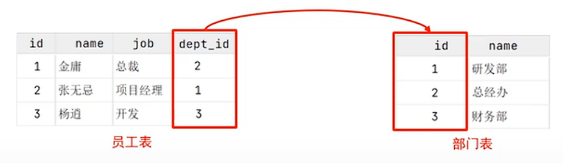
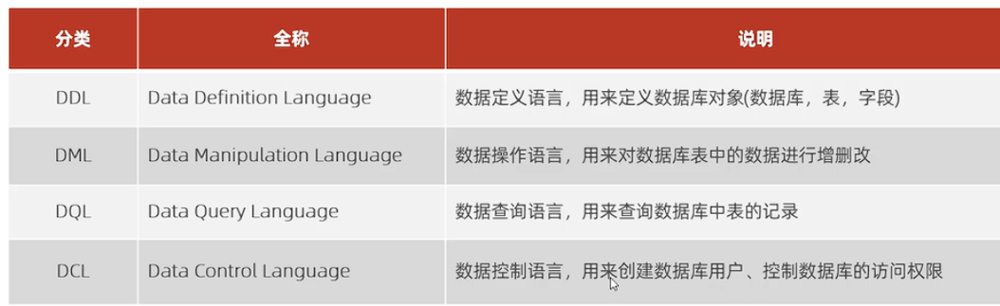

# 数据库相关概念
1.  
    数据库（Database）：存储数据的仓库  
    数据库管理系统： 操纵和管理数据库的大型软件（DBMS），主流的有：  oracle,MySQL,SQLserver    
    SQL:数据库专用语言  

2.
    MySQL相关指令：  
    在cmd中：`net stop mysql80`就是关闭，`net start mysql80`就是启动

3.数据库种类：
    关系型数据库：利用二维表  
      

# SQL
## 通用语法
1.不区分大小写  (**注意**：像命令里的关键字比如create，在团队协作或者工作时大写。来和自己定义的名称区分，增强可读性。但是现在，嘛，毕竟新手先小写)  
2.注释：单行用#或者--，多行用/*   */   
3.以分号结尾 ！

## SQL分类
  

