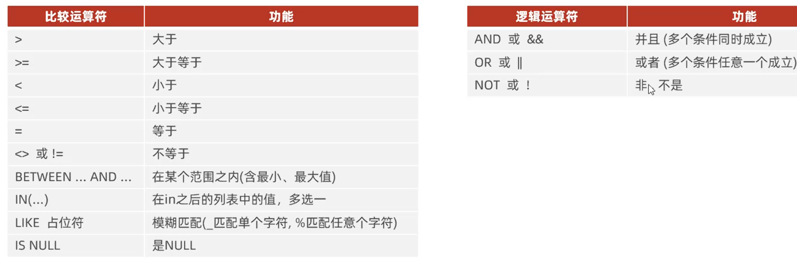
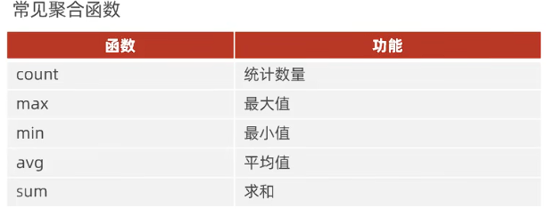

# DDL(对于数据库，表进行修改，不是数据哦)
## 创建数据库
1.查询数据库：`show databases;`  
2.查询当前正在使用的数据库（见5）：`select database();`  
3.创建：`create database [if not exists] 数据库名 [default charset 字符集] [collate 排序规则];`  
4.删除：`drop database [if exists] 数据库名;`  
5.使用：`use 数据库名;`

## 表操作指令（进入库之后）
1.查询**当前数据库**所有表  
`show tables;`  

 

2.查询指定表的建表语句(存放数据的语句)  
`show create table 表名;`  

3.创建表（用一个实例来说明吧）  
比如你要创建一个表格，存储**玩家信息**，比如：1号 东方不败 32岁 男   
**use到指定库之后**，写下面的语句：  
    `create table users(`    
    `->id int comment '编号'，`    
    `->age int comment '年龄'，`    
    `->name varchar(50) comment '姓名'，`    
    `->sex varchar(1) comment '性别'`    
    `)comment '用户表'；`    
  
  - comment 是注释  
  - varchar  存储可变字符串，括号里是最大字符长度（见下一点，数据类型）     

4.查询表**结构**（DESC 是 DESCRIBE 的缩写），在写入数据后：  
`desc 表名;`  

  

5.修改表
- 修改数据类型  
`alter table 表名 modify 字段名 新数据类型(长度);`  

- 修改字段名和字段类型  
`alter table 表名 change 旧字段名 新字段名 类型(长度) [comment 注释] [约束];`  

- 修改表名
  `alter table 表名 rename to 新表名；`  

- 删除表字段：  
`alter table 表名 drop 字段名;`   

- 添加表字段，内容：  
`alter table users add blood int[comment '血量']；`  

6.删除表
- 删除表  
  `drop table [if exist] 表名；`    
- 删除并且重新创建这个表
  `truncate table 表名；`  

## 数据类型
- 1.整数类型
**tinyint**	1 字节，一般用来存状态  
**int**	    4 字节  
**bigint** 8字节，很大，基本用不到  
- 2.小数类型  
**float**	4 字节	不要求精确的小数（比如温度、统计值）  
**double**	8 字节	精度更高	一般小数（比如身高、体重）  
**decimal**	精确小数，无精度丢失	钱、金额、财务数据必须用它（比如 decimal(10,2) 表示最多 10 位，其中 2 位小数）  
- 3.字符型
**char(n)**	固定长度，n 最大 255  
**varchar(n)**	可变长度，n 最大 65535	用于大多数文本  
**text**	大文本，无长度限制	文章内容、评论、详情页大段文字  
- 4.日期时间类型
**date**	YYYY-MM-DD	只存日期  
**datetime**	YYYY-MM-DD HH:MM:SS	存完整时间（比如创建时间、更新时间）  
**timestamp**	时间戳，自动更新	记录最后修改时间（会随时区变化）  

# DML（增删改**数据**）
## 添加（insert)
**单行添加**  
1. 给指定字段添加数据（不用全写，与2区分）  
`insert into 表名 (字段名1, 字段名2, ...) values (值1, 值2, ...);`  

1. 在表中添加数据，新开一行（要写出全部字段！！！）  
`insert into 表名 values (值1, 值2, ...);`  

**批量添加**  
1. 批量添加数据（指定字段）(不同字段添加不同数据，注意**顺序**)  
   
    `insert into 表名 (字段名1, 字段名2, ...) values (值1, 值2, ...), (值1, 值2, ...), (值1, 值2, ...);`  

2. 批量添加数据（全部字段）
`insert into 表名 values (值1, 值2, ...), (值1, 值2, ...), (值1, 值2, ...);`  

**注意要点**  
1. 插入数据时，指定的字段顺序需要与值的顺序是一一对应的  
2. 字符串和日期型数据应该包含在**单引号**中  
3. 插入的数据大小，应该在字段的规定范围内  

## 修改
1. 修改数据
`update 表名 set 字段名1=值1, 字段名2=值2, ... [where 条件];`  
**条件不加可是会修改所有数据的，条件可以是：修改id=1的数据**  

2. 删除数据  
`delete from 表名 [where 条件];`如果不写条件会清空所有  
DELETE 语句不能删除某一个字段的值，就是整行整行的删（可以使用 UPDATE删除一个字段值，设置为空）。  

# DQL（查询数据）
## 基础查询
1. 查询多个字段
`select 字段1, 字段2, 字段3 ... from 表名;`  
或`select * from 表名;`  
查询所有字段（* 是通配符，尽量不要用这个）

2. 给字段设置别名（as 可以省略）
`select 字段1 [as 别名1], 字段2 [as 别名2] ... from 表名;`  

3. 去除指定字段中的重复记录
`select distinct 字段列表 from 表名;`  

## 条件查询
1. `select 字段列表 from 表名 where 条件列表`  
2. 条件列表  
   

 3.这样太抽象了，321上链接（）  
 - `select * from employee where ID is（not） null;`注意是is（not） null，没有数据的（有数据的）   
 - `select * from employee where age in(18,20,24);`在三个中满足其一就入选，相当于or  
 - **LIKE模糊字符**  
    例子：查询名字为两个的员工，语句如下：
    `select * from employee where name like'_ _';`妙啊  
    例子：查询身份证号最后一位为X的id,
    `select * from employee where id like '%X';`  
    意思是说：不管前面有多少位整数，最后是X就可以  

## 聚合函数
**将一列字段进行操作，纵向计算**  
select 聚合函数名（作用字段名） from 表名；  

  

- 举例理解
  `select count(*) from employee;` 就是数有多少个员工  
  `select avg(age) from employee;` 就是算员工平均年龄  
  `select avg(age) from employee where address='西安'；` 就是算西安员工平均年龄  

## 分组查询（having）
`select 字段列表 from 表名 [where] group by 分组字段名[having 分组后过滤条件]；`  
- 例子  
- `select gender, count(*) from emp group by gender;` 这里就是根据gender分为两组，对每一组进行求平均值(注意，是说显示出来的字段列表有gender和计算的总数，在上面记过笔记啊)  
- `select address,count(*) from emp where age<45 group by address [ having count(*) >= 3 ];` 先选出年龄小于45岁的人，按照地址分组再进行计数 ，输出每个地址和人数 [如果加上就是输出总数大于3的地址和人数]   

## 排序查询
`select 字段列表 from 表名 order by 字段1+排序方式  ， 字段2+排序方式；`  
**排序方式：**升序（asc）（默认），降序（desc）,若为多排序方式，**只有第一排序字段 相同 的时候才会 按第二种（见例2）  
**举例**：  
- 根据年龄对职员升序排序  
  `select * from emp order by age asc;`  
- 根据年龄，对职员升序排序，如果年龄相同，在按照入职时间降序排序  
  `select * from emp order by age asc,time desc;`  

## 分页查询
`select 字段列表 from 表名 limit 起始索引，查询记录数；
**注意：**  
- 起始索引从0开始，以一条数据为单位，不是一页！！**起始**索引 = (查询页码 - 1) * 每页显示记录数  
- 分页查询不同的数据库有不同的实现，MySQL中是LIMIT  
- 如果查询的是第一页数据，起始索引可以省略   
  
**例子**  
- 查询第一页员工数据，每页10条记录  
  `select * from emp limit 0,10;`0可以省略  
- 查询第二页每页10条
`select * from emp limit 10,10;` 10=（2-1） * 10  

## DQL**执行**顺序
以上所有语法混在一起，优先级为： from , where , group by , having , select , order by , limit  

# DCL(管理数据库用户，访问权限)
## 用户管理
1. 查询用户  
`use mysql;`  
`select * from user;`  

2. 创建用户  
`create user '用户名'@'主机名' identified by '密码';`  

3. 修改用户密码  
`alter user '用户名'@'主机名' identified with mysql_native_password by '新密码';`  

4. 删除用户  
`drop user '用户名'@'主机名';`  

## 权限控制
1. 查询权限  
`show grants for '用户名'@'主机名';`  

2. 授予权限
`grant 权限列表 on 数据库名.表名 to '用户名'@'主机名';`  

3. 撤销权限
`revoke 权限列表 on 数据库名.表名 from '用户名'@'主机名';`  

