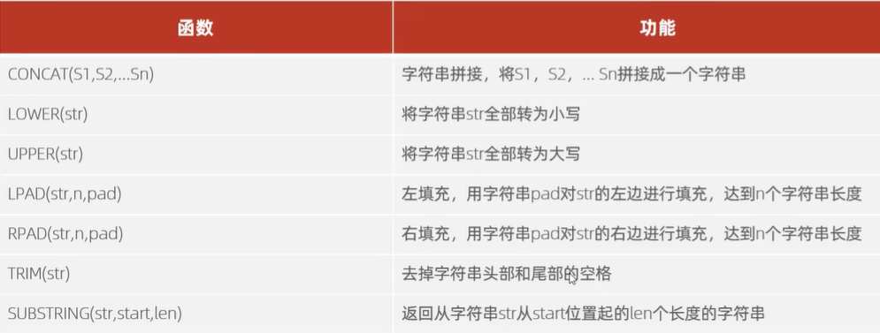
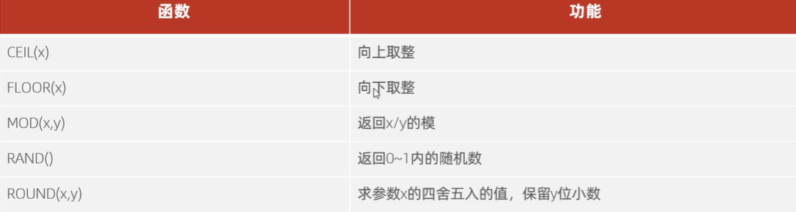
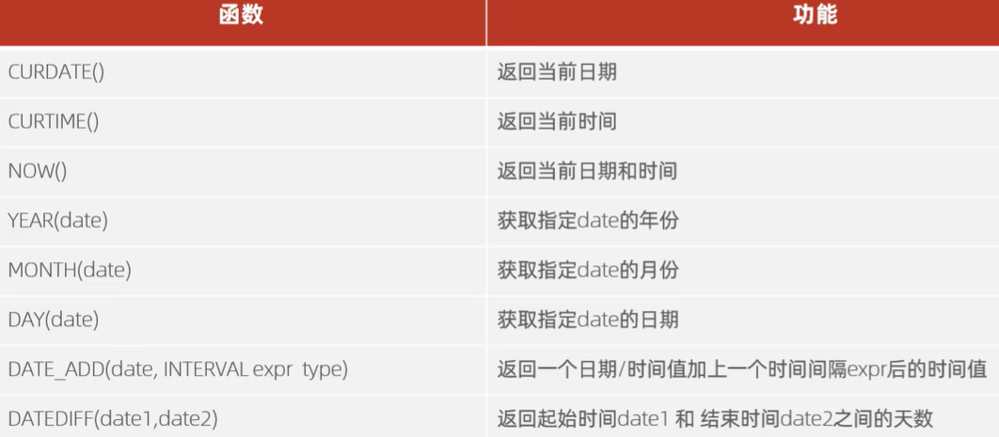

# 函数(记)
## 字符串函数（常用）
  

## 数值函数
  

## 日期函数
  
第4 5 6 个：比如year(now());,就会返回2026  
第7个 ： 间隔时间写好单位  
感觉最后一个好好用（）  

## 流程函数

 1.`if(value, t, f)`  如果value为true，则返回t，否则返回f  

 2.`ifnull(value1, value2)`  如果value1不为空，返回value1，否则返回value2  

 3.`case when [val1] then [res1] ... else [default] end`  如果val1为true，返回res1，… 否则返回default默认值   
 **举例**：
 当城市为北京，上海时，修改城市为一线城市  
 `select city when '北京' then '一线城市' when '上海' then '一线城市' else '二线城市' end from employee；`  

 4.`case [expr] when [val1] then [res1] ... else [default] end`  如果expr的值等于val1，返回res1，… 否则返回default默认值   