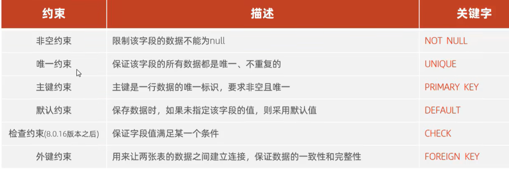
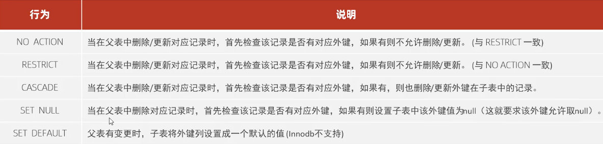

# 约束
约束是写在表里面 **字段**上的规则，但其实还是限制字段中的数据，目的是保证表中的数据有效，正确完整  
注意要在**建表的时候**写约束  

  

有点抽象，举例子：  
构建一个员工表，其中：  

- id是 主键且自动增长  `id int primary key auto_increment comment '主键',`  
- name 不为空且唯一   `name varchar(20) not null unique comment '姓名',`  
- age 大于0小于等于120  `age int check (age>0 && age<=120) comment '年龄',`  
- status 如果没有值就默认为1 `status char(1) default '1' comment '状态';`  

## 外键约束
外键用来在两个表之间建立连接，保证数据一致性完整性  
- 两表连接：在员工表有字段：department_id，里面有值，链接的就是另一张表department的id字段   
但是现在只是表面上有连接，没有在数据库层面建立连接  
- 建立外键    
  添加数据时，写  
  `alter table employee`  
  `add constraint fk_emp_department_id`添加约束，并给约束起名  
  `foreign key (department_id)`声明用的外键，是department表里的id字段  
  `references department(id);`关联到，说明必须用的是父表里的id字段  

 - 删除外键  
  `alter table 表名 drop foreign key 外键名称；`  

- 在父表更新，删除行为时，如何处理子表关联数据：    
    
  在建立外键那个大长句子最后加上on update 行为 on delete 行为  

