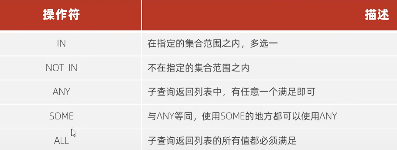

# 多表查询
一个人数据太多的话就会被分开放在多个表中，此时就产生了多表查询，关系很多很杂啊，一对多，多对多，多对一  

## 连接查询

1.内连接  
内连接查询的是两张表交集的地方，有两种查询语法  
- 隐式内连接  
  查询每一个员工的姓名还有所属部门（连接对应数据的，是关联id）  
    `select emp.name, department.name(部门名) from emp,department where emp.department_id = department_id;`  
    可以在表格名后面跟一个别名，写起来方便  
- 同样的需求，用 **显示内连接**   
  `select e.name,d.name from employee e [inner] join department d  on e.department_id = d.id;`  
  
  
     

2.外连接  
当两个表建立关联了，一定有交集部分对吧，外连接就是专门输出独属于某一个表和交集部分的数据的，分为左外连接和右外连接(**左右就看join左边和右边**)  
- 左外连接  
  查询员工左表中所有数据 和 部门数据  
  `select e.* , d.name from employee e left [outer] join department d on e.department_id = d.id;`  

- 右外连接（就稍微改改就行，和左特别相似）  

  
3.自连接  
 先理解为啥有自连接：和上面不同，上面是多张表之间有关联，这回是一个表，其中几个字段存放的是不同于本条数据的其他数据的id，用于连接到本表中的其他数据（例子：组长，成员都是员工，但组长是员工上司，用字段manager_id存放组长id）  
 这种在写的时候把一张表看做两张表 ，用自连接外连接语法都行，效果不同   
- 例子  
  查询员工对应的领导(没有的不显示)  
  `select a.name , b.name from employee a，employee b where a.manager_id = b.id;`   
如果是没有领导的也要显示，就用左外连接  

## 子查询（嵌套查询）  
### 标量子查询  
返回的是单个值（日期，字符，数字）这种最简单的形式  
- 例  
  查询在销售部的员工信息：先查出销售部id是多少，再根据id查员工数据  
`select * from employee where department_id = (select id from department where name = '销售部'); `这里的子查询只返回id对吧，标量  

### 列子查询  
返回的是一列信息  
  

1. in( )  
  查询在销售部和市场部的员工信息  
  `select * from employee where department_id = in (select id from department where name='销售部' or name = '市场部')；`  

1. all( )  
   查询比财务部所有人工资都高的人信息  
 双层嵌套，先查财务部id，然后工资，最后信息  
 `select * from emp where salary >all（select salary from emp where dep_id = （select id from dep where name = '财务部'））;`   

### 行子查询  
你懂的  
- 例  
  查询和 张无忌 的薪资还有领导 都相同的 员工的信息(这种一一对应的怎么写呢)  
  `select * from emp where (salary,manager) = (select salary,manager from emp where name = '张无忌');`  

### 表子查询  
- 例  
  1.查询 与 员工A和B的薪资和职位 相同 的员工信息  
  `select * from e where (salary , job) in  (select salary,job from employee e where name = 'A' or name = 'B'）);`  
  in理解为：salary 和 job 至少满足和括号里其中一组 相同的  
  2. 查询 入职日期在2009-01-16 之后 的员工 的信息 以及 部门信息  
   看那个部门信息，非常别扭，因为它实质上需要嵌套查询才select得到。可以把入职日期在2009之后的员工信息看做表，
   `select e.*, d .*`     
   `from (select * from emp where entrydata > 2009-01-16) e(别名)`    
   `left join dep d`     
   `on e.dep_id = d.id;`   
   关联之后就可以随便取啦，但是注意说表名啊，.上  
  

