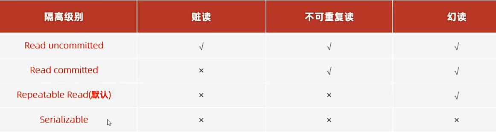

# 事务
一组操作的集合，这些操作要么同时成功，要么同时失败  
- 假如写一个转账操作：  
  `set @@autocommit;`自动提交，若想手动提交加上=0  
  `select @@autocommit;`查看提交方式  

  `start transaction`或`begin`开启一项事务  
  `update account set money = money - 1000 where name='张三';`  
  `update account set money = money + 1000 where name='李四';`  

  `commit；`如果事务成功，提交    
  `rollback;`如果出现异常，回滚，将数据恢复原来的状态  

## 并发事务问题
1.**脏读**：一个事务读到了另一个事务还没提交的操作  
2.**不可重复读**  ：一个事务先后读了同一条记录，但是中间已经被另一个事务修改  
3.**幻读**： 一个事务执行时还没有相关数据，结果要插入数据的时候发现被另一个抢先了

- **隔离级别**  
    
  来解释一下：  
  隔离级别就是一种状态，  
  **第一行**：在未提交只读状态下，三个问题都可能出现  
  **第二行状态下**，开两个命令行同时对一个表中数据进行操作，避免了脏读问题，但一个事务修改数据并提交后，另一个事务再读，就已经改了（不可重复读）  
  **第三行**相比第二行，当另一个事务继续读，就不会是修改的结果了  
  隔离级别越高，数据越安全，但是性能越低

- 语句  
  `select @@transcation_isolation;` 查看当前隔离级别  
  `set [session 当前会话/ global 所有] transcation isolation level {四种级别选一个}；` 设置级别  

   